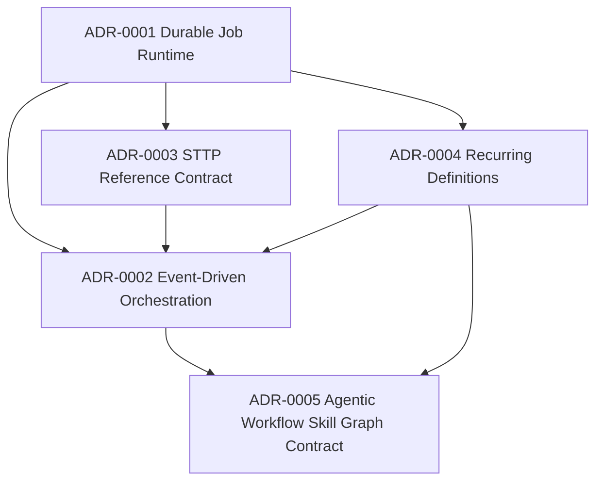

# Architecture Decision Records

## Document Metadata

- Document Type: Architecture Standard
- Audience: Engineer, Security, Architect
- Stability: Stable
- Last Verified: 2026-05-25
- Verified Against:
  - docs/adr/README.md
  - docs-book/src/adr.md

## Purpose

Track major architectural decisions with rationale, alternatives, and consequences.

## ADR Index

| ADR | Title | Status | Date |
| --- | --- | --- | --- |
| ADR-0001 | Durable Job Runtime on SurrealDB | Accepted | 2026-05-07 |
| ADR-0002 | Event-Driven Orchestration with Local CoR | Accepted | 2026-05-07 |
| ADR-0003 | STTP Reference-Only Job Context Contract | Accepted | 2026-05-07 |
| ADR-0004 | Recurring Jobs via Materialized Schedule Definitions | Accepted | 2026-05-07 |
| ADR-0005 | Agentic Workflow Skill Graph Contract | Accepted | 2026-05-25 |

## Decision Dependency Diagram

## ADR-0001 Durable Job Runtime on SurrealDB

- Status: Accepted
- Context: Need durable orchestration semantics with lease and retry support.
- Decision: Use SurrealDB as primary runtime backing store.
- Consequences:
  - Positive: durable, queryable runtime state.
  - Tradeoff: careful index and lease query tuning required.

## ADR-0002 Event-Driven Orchestration with Local CoR

- Status: Accepted
- Context: Need composable cross-capability execution while preserving deterministic local processing.
- Decision: Use events/jobs across capabilities and CoR within a single execution path.
- Consequences:
  - Positive: clean boundaries and flexible orchestration.
  - Tradeoff: eventual consistency and idempotency discipline required.

## ADR-0003 STTP Reference-Only Job Context Contract

- Status: Accepted
- Context: Large payloads in job rows reduce performance and complicate lifecycle management.
- Decision: Store only STTP references and artifact handles in job metadata.
- Consequences:
  - Positive: small hot rows and better queue scan performance.
  - Tradeoff: additional fetch step during execution.

## ADR-0004 Recurring Jobs via Materialized Schedule Definitions

- Status: Accepted
- Context: Need periodic automation (for example web scraping) with distributed safety.
- Decision: Scheduler materializes recurring definitions into standard jobs under lease.
- Consequences:
  - Positive: unified runtime semantics for one-off and recurring jobs.
  - Tradeoff: scheduler lock and drift monitoring required.

## ADR-0005 Agentic Workflow Skill Graph Contract

- Status: Accepted
- Context: Workflow builder semantics drifted between visual placeholders and source-first implementation details.
- Decision: Define workflow as a versioned AI skill graph where nodes are Grapheme function steps and edges are piped function contracts; compile graph to Grapheme source and execute via trigger-bound jobs referencing immutable workflow revisions.
- Consequences:
  - Positive: deterministic graph->source->runtime parity and clearer product semantics.
  - Tradeoff: requires graph schema/versioning, compiler determinism, and round-trip policy for advanced source edits.
