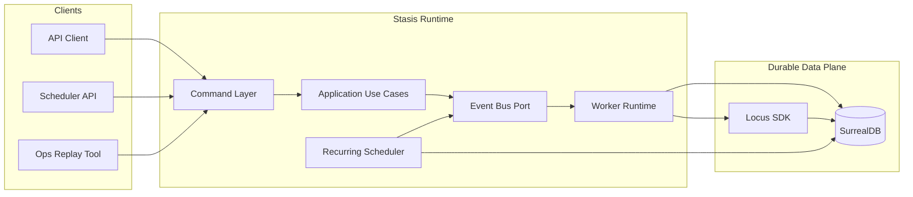
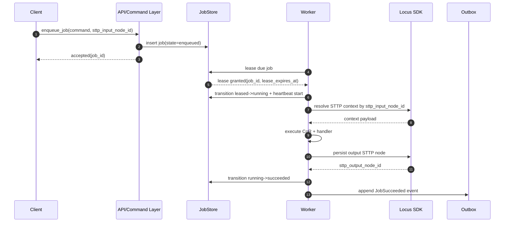
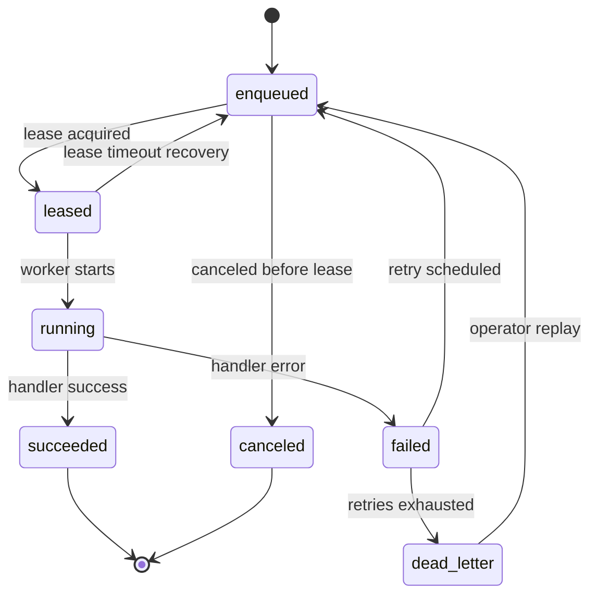

# Stasis Architecture Overview

## Document Metadata

- Document Type: Architecture Standard
- Audience: Engineer, SRE, Security, Architect
- Stability: Evolving
- Last Verified: 2026-05-15
- Verified Against:
  - src/application/runtime/stasis_runtime_builder.rs
  - src/application/use_cases/investigate_runtime_lineage.rs
  - src/domain/runtime/outbox.rs
  - tests/runtime_backend_parity.rs
  - tests/architecture_conformance.rs

## Document Status

- Version: v1-draft
- Audience: Engineering, Platform, SRE, Security
- Scope: Runtime architecture for durable job orchestration in Stasis

## Executive Summary

Stasis uses DDD + Hexagonal architecture and an event-driven runtime backed by SurrealDB. The platform now composes three capability planes under one framework boundary:

1. Stasis orchestration/runtime core for durable job execution and observability.
2. Grapheme workflow execution for policy-governed workflow jobs.
3. Locus memory services for retrieval, storage, transform, rollup, and schema workflows.

The runtime is designed for at-least-once job execution with deterministic idempotent handlers, durable leases, retries, dead-letter handling, replay, and lineage investigation.

## Architecture Principles

1. Durable by default: critical execution state lives in SurrealDB.
2. Event-driven orchestration: capabilities coordinate via events, not direct coupling.
3. Local determinism: chain-of-responsibility pipelines are used inside a single job execution path.
4. Context by reference: STTP node IDs are passed across job boundaries rather than large payload blobs.
5. Replaceable infrastructure: adapters implement ports so backends can evolve without domain rewrites.
6. Capability isolation with unified contracts: Grapheme and Locus integrations remain behind Stasis ports and handlers.
7. Diagnostics and lineage by default: orchestration handlers emit standardized diagnostics and outbox lineage metadata.

## Capability Planes

### 1) Stasis Core Plane

- Runtime lifecycle: enqueue, lease, run, retry, dead-letter, replay.
- Orchestration patterns: sequential, concurrent, handoff, orchestrator-routed.
- Middleware chain: logging, telemetry, cache, and tool-call interception.
- Outbox/eventing: durable event capture and publish retries.

### 2) Grapheme Plane

- Workflow job execution via Grapheme-backed handlers.
- Guardrail-aware outcomes with policy classification in attempt diagnostics.
- Runtime parity behavior across in-memory and Surreal backends.

### 3) Locus Plane

- Memory recall/write and advanced memory operations (aggregate, transform, rollup, schema).
- Memory lineage projection into runtime outbox metadata:
  - input query IDs/fingerprint
  - output memory node IDs
  - retrieval path

## System Context

## Runtime Components

1. Command Layer
- Accepts job commands, validates contracts, and routes to use cases.

2. Application Use Cases
- Coordinates domain invariants and state transitions through ports.

3. Worker Runtime
- Leases jobs, executes handlers, heartbeats, and writes results.

4. Orchestration Pattern Handlers
- Typed orchestration handlers for sequential, concurrent, handoff, and orchestrator-routed flows.
- Thread-bound execution with explicit `thread_id` support and branch lineage semantics.

5. Grapheme Workflow Handlers
- Grapheme echo, textops, healthcheck, and guarded workflow execution.

6. Locus Memory Handlers
- Recall/write-aware prompt and tool-loop flows.
- Dedicated memory operation job handlers for aggregate/transform/rollup/schema.

7. Recurring Scheduler
- Materializes due recurring definitions into executable jobs.

8. Outbox Publisher
- Publishes committed runtime/domain events safely after persistence.

9. Observability Pipeline
- Emits metrics and traces keyed by correlation and trace IDs.
- Preserves attempt diagnostics with guardrail and orchestration metadata.
- Supports lineage investigation by job, execution, guardrail code, and thread selectors.

## Thread and Lineage Model

Stasis treats thread continuity as a first-class concern for orchestration observability.

- `thread_id` is persisted in runtime lineage events.
- Concurrent branches create descendant thread IDs using `root::branch::<branch_id>` semantics.
- Concurrent completions emit explicit merge metadata (`ThreadMergeMetadata`) in diagnostics.
- Lineage investigation supports thread-only selectors with optional ancestry expansion.
- Root thread selectors can expand descendant branch lineage through indexed thread-prefix queries.

## Request and Execution Flow

## Job Lifecycle

## Chain of Responsibility Boundary

Use CoR for ordered, in-process concerns inside one job execution:
- request validation
- policy and guardrails
- prompt/context enrichment
- result shaping

Use events and jobs for cross-capability orchestration:
- planner to executor handoffs
- asynchronous tool operations
- delayed and recurring workloads
- saga compensation and replay
- cross-plane interactions (Stasis core + Grapheme + Locus)

## Reliability and SLO Controls

- Delivery semantics: at-least-once.
- Lease safety: owner token + expiration + heartbeat.
- Duplicate safety: idempotency key + deterministic handlers.
- Failure isolation: retry with backoff and dead-letter queue.
- Recovery: operator replay with full causation chain.

## Security and Compliance Considerations

1. Restrict sensitive secrets in job payload metadata.
2. Keep tenant and auth context explicit in command contracts.
3. Preserve immutable audit fields for state transitions.
4. Apply queue-level policy controls for privileged job types.

## Decision Diagram

## Related Documents

- Runtime draft: [Runtime V1 Draft](./runtime-v1-draft.md)
- Job runtime design: [Job Runtime Design](./runtime-job-design.md)
- Database schema: [SurrealDB Schema](./surrealdb-schema.md)
- Stasis framework RFC: [Stasis Framework RFC](./stasis-framework-rfc.md)
- Stasis implementation plan: [Stasis Framework Implementation Plan](./stasis-framework-implementation-plan.md)
- Locus integration plan: [Locus Integration RFC and Plan](./locus-integration-rfc-plan.md)
- Microsoft-stack parity roadmap: [Microsoft-Stack Parity Roadmap](./microsoft-stack-parity-roadmap.md)
- Microsoft-stack compatibility matrix: [Microsoft-Stack Compatibility Matrix](./microsoft-stack-compatibility-matrix.md)
- ADR index: [Architecture Decision Records](./adr.md)
