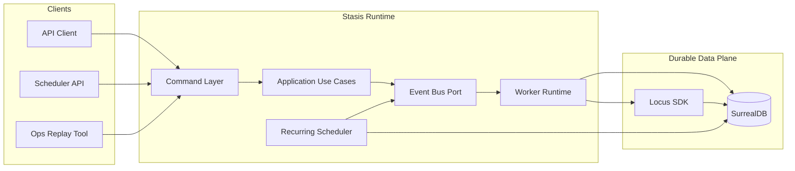
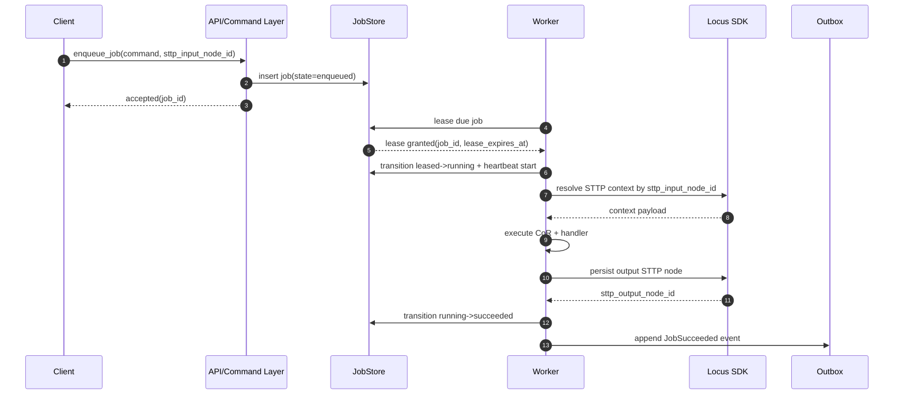
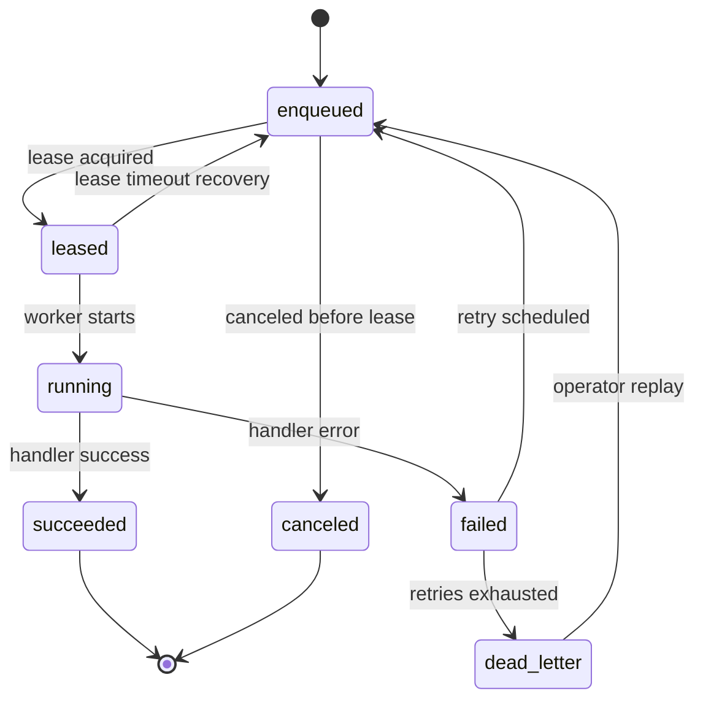
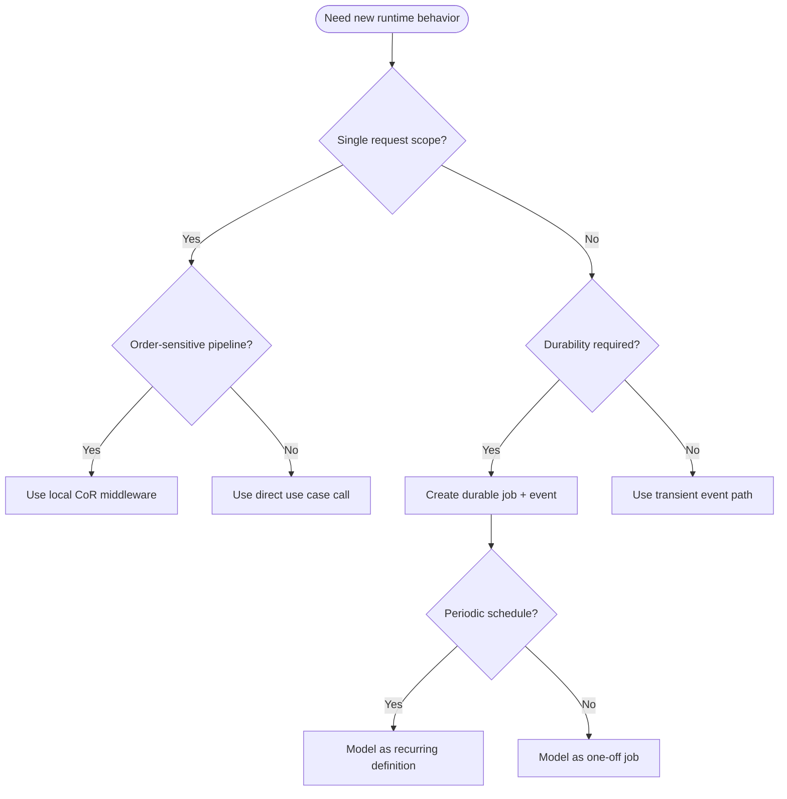

# Stasis Architecture Overview

## Document Status

- Version: v1-draft
- Audience: Engineering, Platform, SRE, Security
- Scope: Runtime architecture for durable job orchestration in Stasis

## Executive Summary

Stasis uses DDD + Hexagonal architecture and an event-driven runtime backed by SurrealDB. The runtime is designed for at-least-once job execution with deterministic idempotent handlers, durable leases, retries, and dead-letter handling.

## Architecture Principles

1. Durable by default: critical execution state lives in SurrealDB.
2. Event-driven orchestration: capabilities coordinate via events, not direct coupling.
3. Local determinism: chain-of-responsibility pipelines are used inside a single job execution path.
4. Context by reference: STTP node IDs are passed across job boundaries rather than large payload blobs.
5. Replaceable infrastructure: adapters implement ports so backends can evolve without domain rewrites.

## System Context

## Runtime Components

1. Command Layer
- Accepts job commands, validates contracts, and routes to use cases.

2. Application Use Cases
- Coordinates domain invariants and state transitions through ports.

3. Worker Runtime
- Leases jobs, executes handlers, heartbeats, and writes results.

4. Recurring Scheduler
- Materializes due recurring definitions into executable jobs.

5. Outbox Publisher
- Publishes committed runtime/domain events safely after persistence.

6. Observability Pipeline
- Emits metrics and traces keyed by correlation and trace IDs.

## Request and Execution Flow

## Job Lifecycle

## Chain of Responsibility Boundary

Use CoR for ordered, in-process concerns inside one job execution:
- request validation
- policy and guardrails
- prompt/context enrichment
- result shaping

Use events and jobs for cross-capability orchestration:
- planner to executor handoffs
- asynchronous tool operations
- delayed and recurring workloads
- saga compensation and replay

## Reliability and SLO Controls

- Delivery semantics: at-least-once.
- Lease safety: owner token + expiration + heartbeat.
- Duplicate safety: idempotency key + deterministic handlers.
- Failure isolation: retry with backoff and dead-letter queue.
- Recovery: operator replay with full causation chain.

## Security and Compliance Considerations

1. Restrict sensitive secrets in job payload metadata.
2. Keep tenant and auth context explicit in command contracts.
3. Preserve immutable audit fields for state transitions.
4. Apply queue-level policy controls for privileged job types.

## Decision Diagram

## Related Documents

- Runtime draft: [Runtime V1 Draft](./runtime-v1-draft.md)
- Job runtime design: [Job Runtime Design](./runtime-job-design.md)
- Database schema: [SurrealDB Schema](./surrealdb-schema.md)
- ADR index: [Architecture Decision Records](./adr.md)
