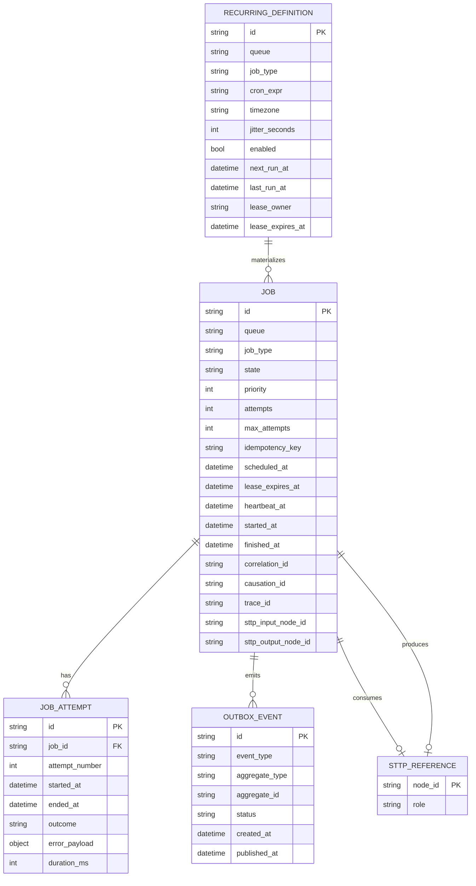

# SurrealDB Schema Specification

## Purpose

Define the V1 SurrealDB schema and indexing strategy for Stasis durable job orchestration.

## Design Constraints

1. Fast lookup for due and lease-expired jobs.
2. Append-observable state transitions via events/outbox.
3. Small hot rows with reference-based payload model.
4. Explicit keys for correlation, causation, and idempotency.

## Logical Entity Relationship



## SurrealDB Tables

```sql
DEFINE TABLE job SCHEMAFULL;
DEFINE FIELD queue ON TABLE job TYPE string;
DEFINE FIELD job_type ON TABLE job TYPE string;
DEFINE FIELD payload_ref ON TABLE job TYPE string;
DEFINE FIELD state ON TABLE job TYPE string ASSERT $value INSIDE [
  'enqueued',
  'leased',
  'running',
  'succeeded',
  'failed',
  'dead_letter',
  'canceled'
];
DEFINE FIELD priority ON TABLE job TYPE int DEFAULT 100;
DEFINE FIELD attempts ON TABLE job TYPE int DEFAULT 0;
DEFINE FIELD max_attempts ON TABLE job TYPE int DEFAULT 10;
DEFINE FIELD backoff_policy ON TABLE job TYPE object;
DEFINE FIELD idempotency_key ON TABLE job TYPE string;
DEFINE FIELD correlation_id ON TABLE job TYPE string;
DEFINE FIELD causation_id ON TABLE job TYPE string;
DEFINE FIELD trace_id ON TABLE job TYPE string;
DEFINE FIELD sttp_input_node_id ON TABLE job TYPE string;
DEFINE FIELD sttp_output_node_id ON TABLE job TYPE option<string>;
DEFINE FIELD lease_owner ON TABLE job TYPE option<string>;
DEFINE FIELD lease_expires_at ON TABLE job TYPE option<datetime>;
DEFINE FIELD heartbeat_at ON TABLE job TYPE option<datetime>;
DEFINE FIELD scheduled_at ON TABLE job TYPE datetime;
DEFINE FIELD started_at ON TABLE job TYPE option<datetime>;
DEFINE FIELD finished_at ON TABLE job TYPE option<datetime>;
DEFINE FIELD last_error ON TABLE job TYPE option<object>;
DEFINE FIELD created_at ON TABLE job TYPE datetime DEFAULT time::now();
DEFINE FIELD updated_at ON TABLE job TYPE datetime VALUE time::now();

DEFINE INDEX idx_job_state_queue_sched ON TABLE job COLUMNS state, queue, scheduled_at;
DEFINE INDEX idx_job_lease_expiry ON TABLE job COLUMNS lease_expires_at;
DEFINE INDEX uq_job_idempotency ON TABLE job COLUMNS idempotency_key UNIQUE;
DEFINE INDEX idx_job_correlation ON TABLE job COLUMNS correlation_id;
DEFINE INDEX idx_job_trace ON TABLE job COLUMNS trace_id;
```

```sql
DEFINE TABLE job_attempt SCHEMAFULL;
DEFINE FIELD job_id ON TABLE job_attempt TYPE record<job>;
DEFINE FIELD attempt_number ON TABLE job_attempt TYPE int;
DEFINE FIELD started_at ON TABLE job_attempt TYPE datetime;
DEFINE FIELD ended_at ON TABLE job_attempt TYPE option<datetime>;
DEFINE FIELD outcome ON TABLE job_attempt TYPE string ASSERT $value INSIDE [
  'running',
  'succeeded',
  'failed',
  'canceled'
];
DEFINE FIELD error_payload ON TABLE job_attempt TYPE option<object>;
DEFINE FIELD duration_ms ON TABLE job_attempt TYPE option<int>;
DEFINE FIELD worker_id ON TABLE job_attempt TYPE option<string>;

DEFINE INDEX idx_attempt_job ON TABLE job_attempt COLUMNS job_id, attempt_number;
```

```sql
DEFINE TABLE recurring_definition SCHEMAFULL;
DEFINE FIELD queue ON TABLE recurring_definition TYPE string;
DEFINE FIELD job_type ON TABLE recurring_definition TYPE string;
DEFINE FIELD payload_template_ref ON TABLE recurring_definition TYPE string;
DEFINE FIELD cron_expr ON TABLE recurring_definition TYPE string;
DEFINE FIELD timezone ON TABLE recurring_definition TYPE string;
DEFINE FIELD jitter_seconds ON TABLE recurring_definition TYPE int DEFAULT 0;
DEFINE FIELD enabled ON TABLE recurring_definition TYPE bool DEFAULT true;
DEFINE FIELD next_run_at ON TABLE recurring_definition TYPE datetime;
DEFINE FIELD last_run_at ON TABLE recurring_definition TYPE option<datetime>;
DEFINE FIELD lease_owner ON TABLE recurring_definition TYPE option<string>;
DEFINE FIELD lease_expires_at ON TABLE recurring_definition TYPE option<datetime>;
DEFINE FIELD created_at ON TABLE recurring_definition TYPE datetime DEFAULT time::now();
DEFINE FIELD updated_at ON TABLE recurring_definition TYPE datetime VALUE time::now();

DEFINE INDEX idx_recurring_due ON TABLE recurring_definition COLUMNS enabled, next_run_at;
DEFINE INDEX idx_recurring_lease_expiry ON TABLE recurring_definition COLUMNS lease_expires_at;
```

```sql
DEFINE TABLE outbox_event SCHEMAFULL;
DEFINE FIELD event_type ON TABLE outbox_event TYPE string;
DEFINE FIELD aggregate_type ON TABLE outbox_event TYPE string;
DEFINE FIELD aggregate_id ON TABLE outbox_event TYPE string;
DEFINE FIELD job_id ON TABLE outbox_event TYPE option<record<job>>;
DEFINE FIELD payload ON TABLE outbox_event TYPE object;
DEFINE FIELD status ON TABLE outbox_event TYPE string ASSERT $value INSIDE [
  'pending',
  'published',
  'failed'
];
DEFINE FIELD created_at ON TABLE outbox_event TYPE datetime DEFAULT time::now();
DEFINE FIELD published_at ON TABLE outbox_event TYPE option<datetime>;
DEFINE FIELD publish_attempts ON TABLE outbox_event TYPE int DEFAULT 0;

DEFINE INDEX idx_outbox_pending ON TABLE outbox_event COLUMNS status, created_at;
DEFINE INDEX idx_outbox_aggregate ON TABLE outbox_event COLUMNS aggregate_type, aggregate_id;
```

## Leasing and Concurrency Notes

1. Lease updates should include compare-and-set predicates on state and current lease values.
2. Worker heartbeat should only update rows leased by the same worker identity.
3. Replay actions should emit explicit outbox events with causation lineage.

## Retention and Archival Strategy

1. Keep active jobs in hot tables.
2. Move terminal jobs older than retention threshold to archive tables.
3. Preserve outbox and attempt records according to compliance retention windows.

## Open Migration Topics

1. Multi-tenant key strategy: single table with tenant_id vs per-tenant namespace.
2. Partitioning strategy for very high queue cardinality.
3. Event payload versioning and schema evolution process.
