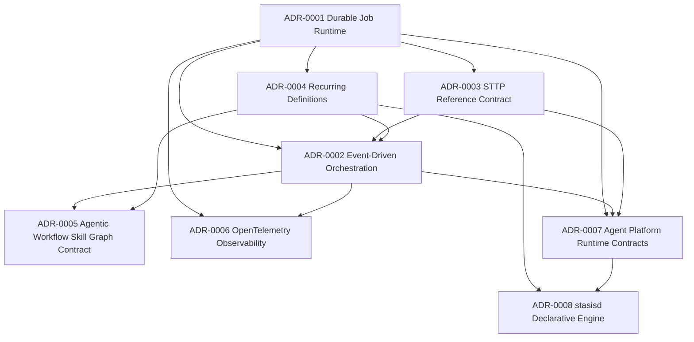

# Architecture Decision Records

## Document Metadata

- Document Type: Architecture Standard
- Audience: Engineer, Security, Architect
- Stability: Stable
- Last Verified: 2026-07-22
- Verified Against:
  - docs/adr/README.md
  - docs/adr/ADR-0007-agent-platform-runtime-contracts.md
  - docs/adr/ADR-0008-stasisd-declarative-engine.md
  - docs/design/agent-platform-runtime-contracts-plan.md
  - docs/design/stasisd-declarative-engine-plan.md
  - docs-book/src/adr.md

## Purpose

Track major architectural decisions with rationale, alternatives, and consequences.

## ADR Index

| ADR | Title | Status | Date |
| --- | --- | --- | --- |
| ADR-0001 | Durable Job Runtime on SurrealDB | Accepted | 2026-05-07 |
| ADR-0002 | Event-Driven Orchestration with Local CoR | Accepted | 2026-05-07 |
| ADR-0003 | STTP Reference-Only Job Context Contract | Accepted | 2026-05-07 |
| ADR-0004 | Recurring Jobs via Materialized Schedule Definitions | Accepted | 2026-05-07 |
| ADR-0005 | Agentic Workflow Skill Graph Contract | Accepted | 2026-05-25 |
| ADR-0006 | OpenTelemetry First-Class Observability | Accepted | 2026-06-04 |
| ADR-0007 | Agent Platform Runtime Contracts | Proposed | 2026-07-22 |
| ADR-0008 | `stasisd` Declarative Engine | Proposed | 2026-07-22 |

## Decision Dependency Diagram

## ADR-0008 `stasisd` Declarative Engine

- Status: Proposed
- Context: Operators need a small deployable that turns YAML/TOML desired state into live agent schedules — the nginx of AI orchestration — without reinventing recurring registration in every app.
- Decision: Ship `stasisd` as a thin reconcile+tick engine on top of the Stasis runtime: watch config files, map them to managed `RecurringDefinition`s, and apply drain/cancel/orphan policies on remove.
- Consequences:
  - Positive: GitOps-friendly schedules; clear kernel vs deployable split; reuses existing materialization/leases.
  - Tradeoff: versioned config schema, provenance ownership, and explicit delete/drain semantics required.
- Plan: [design/stasisd-declarative-engine-plan.md](../design/stasisd-declarative-engine-plan.md)
- Full ADR: [ADR-0008-stasisd-declarative-engine.md](ADR-0008-stasisd-declarative-engine.md)

## ADR-0007 Agent Platform Runtime Contracts

- Status: Proposed
- Context: Stasis should be the durable work runtime for agent platforms (MassTransit/Hangfire role), not a vendor integration hub for IDE/CLI agents.
- Decision: Ship three vendor-neutral contracts — Comms (bidirectional durable messaging), Translation (canonical envelope codecs), and MCP tool bridge (injectable provider/exporter around `StasisTool`) — with gateways implemented outside core.
- Consequences:
  - Positive: platform builders can inject gateways via DI; core stays product-agnostic; durability/leases/outbox remain the coordination backbone.
  - Tradeoff: requires frozen canonical envelope versioning, ingress/waitable-turn state, and MCP recursion guards.
- Plan: [design/agent-platform-runtime-contracts-plan.md](../design/agent-platform-runtime-contracts-plan.md)
- Full ADR: [ADR-0007-agent-platform-runtime-contracts.md](ADR-0007-agent-platform-runtime-contracts.md)

## ADR-0006 OpenTelemetry First-Class Observability

- Status: Accepted
- Context: Runtime metrics default to noop; no OTLP traces; operators need one complete observability path.
- Decision: Ship OpenTelemetry (metrics + traces + W3C propagation) in a single 0.3.0 release behind optional `otel` feature; freeze contract in opentelemetry-integration-rfc-plan.md.
- Consequences:
  - Positive: OTLP export, linked traces across jobs/LLM/memory/outbox, stable instrument names.
  - Tradeoff: concentrated instrumentation work; contract maintenance obligation.
- Plan: [design/opentelemetry-integration-rfc-plan.md](../design/opentelemetry-integration-rfc-plan.md)

## ADR-0001 Durable Job Runtime on SurrealDB

- Status: Accepted
- Context: Need durable orchestration semantics with lease and retry support.
- Decision: Use SurrealDB as primary runtime backing store.
- Consequences:
  - Positive: durable, queryable runtime state.
  - Tradeoff: careful index and lease query tuning required.

## ADR-0002 Event-Driven Orchestration with Local CoR

- Status: Accepted
- Context: Need composable cross-capability execution while preserving deterministic local processing.
- Decision: Use events/jobs across capabilities and CoR within a single execution path.
- Consequences:
  - Positive: clean boundaries and flexible orchestration.
  - Tradeoff: eventual consistency and idempotency discipline required.

## ADR-0003 STTP Reference-Only Job Context Contract

- Status: Accepted
- Context: Large payloads in job rows reduce performance and complicate lifecycle management.
- Decision: Store only STTP references and artifact handles in job metadata.
- Consequences:
  - Positive: small hot rows and better queue scan performance.
  - Tradeoff: additional fetch step during execution.

## ADR-0004 Recurring Jobs via Materialized Schedule Definitions

- Status: Accepted
- Context: Need periodic automation (for example web scraping) with distributed safety.
- Decision: Scheduler materializes recurring definitions into standard jobs under lease.
- Consequences:
  - Positive: unified runtime semantics for one-off and recurring jobs.
  - Tradeoff: scheduler lock and drift monitoring required.

## ADR-0005 Agentic Workflow Skill Graph Contract

- Status: Accepted
- Context: Workflow builder semantics drifted between visual placeholders and source-first implementation details.
- Decision: Define workflow as a versioned AI skill graph where nodes are Grapheme function steps and edges are piped function contracts; compile graph to Grapheme source and execute via trigger-bound jobs referencing immutable workflow revisions.
- Consequences:
  - Positive: deterministic graph->source->runtime parity and clearer product semantics.
  - Tradeoff: requires graph schema/versioning, compiler determinism, and round-trip policy for advanced source edits.
