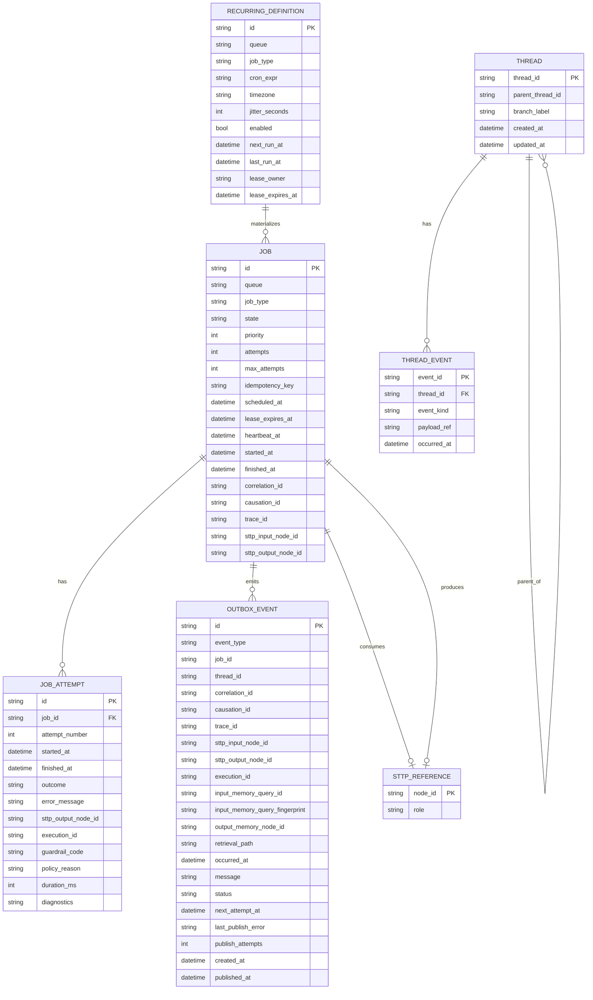

# SurrealDB Schema Specification

## Document Metadata

- Document Type: Reference Standard
- Audience: Engineer, SRE, Architect
- Stability: Evolving
- Last Verified: 2026-05-24
- Verified Against:
  - src/infrastructure/runtime/surreal_job_store.rs
  - src/infrastructure/runtime/surreal_job_attempt_store.rs
  - src/infrastructure/runtime/surreal_outbox_store.rs
  - src/infrastructure/runtime/surreal_recurring_store.rs
  - src/infrastructure/runtime/surreal_thread_store.rs
  - src/infrastructure/runtime/surreal_cluster_forward_outcome_store.rs
  - src/infrastructure/memory/surreal_identity_memory_store.rs
  - tests/runtime_backend_parity.rs

## Purpose

Define the V1 SurrealDB schema and indexing strategy for Stasis durable job orchestration.

## Design Constraints

1. Fast lookup for due and lease-expired jobs.
2. Append-observable state transitions via events/outbox.
3. Small hot rows with reference-based payload model.
4. Explicit keys for correlation, causation, and idempotency.
5. First-class thread and lineage metadata for orchestration observability.

## Control Plane Extension Tables

Forwarded command outcomes can be persisted durably for distributed command-center operations.

```sql
DEFINE TABLE cluster_forward_outcome SCHEMAFULL;
DEFINE FIELD target_region ON TABLE cluster_forward_outcome TYPE string;
DEFINE FIELD command_name ON TABLE cluster_forward_outcome TYPE string;
DEFINE FIELD correlation_id ON TABLE cluster_forward_outcome TYPE option<string>;
DEFINE FIELD accepted ON TABLE cluster_forward_outcome TYPE bool;
DEFINE FIELD attempts ON TABLE cluster_forward_outcome TYPE int;
DEFINE FIELD error ON TABLE cluster_forward_outcome TYPE option<string>;
DEFINE FIELD completed_at ON TABLE cluster_forward_outcome TYPE datetime;

DEFINE INDEX idx_cluster_forward_outcome_completed_at
  ON TABLE cluster_forward_outcome COLUMNS completed_at;
DEFINE INDEX idx_cluster_forward_outcome_corr
  ON TABLE cluster_forward_outcome COLUMNS correlation_id;
```

## Identity Memory Tables

Identity persistence uses schemafull Surreal tables for persona, user, channel, policy profiles, relationship graph state, proposal workflow, and transition/version history.

```sql
DEFINE TABLE identity_persona SCHEMAFULL;
DEFINE FIELD persona_id ON TABLE identity_persona TYPE string;
DEFINE FIELD display_name ON TABLE identity_persona TYPE string;
DEFINE FIELD status ON TABLE identity_persona TYPE string;
DEFINE FIELD version ON TABLE identity_persona TYPE int;
DEFINE FIELD updated_at ON TABLE identity_persona TYPE datetime;

DEFINE TABLE identity_user SCHEMAFULL;
DEFINE FIELD user_id ON TABLE identity_user TYPE string;
DEFINE FIELD timezone ON TABLE identity_user TYPE string;
DEFINE FIELD language_variant ON TABLE identity_user TYPE option<string>;
DEFINE FIELD status ON TABLE identity_user TYPE string;
DEFINE FIELD version ON TABLE identity_user TYPE int;
DEFINE FIELD updated_at ON TABLE identity_user TYPE datetime;

DEFINE TABLE identity_channel_profile SCHEMAFULL;
DEFINE FIELD channel_id ON TABLE identity_channel_profile TYPE string;
DEFINE FIELD channel_type ON TABLE identity_channel_profile TYPE string;
DEFINE FIELD proactive_allowed ON TABLE identity_channel_profile TYPE bool;
DEFINE FIELD status ON TABLE identity_channel_profile TYPE string;
DEFINE FIELD version ON TABLE identity_channel_profile TYPE int;
DEFINE FIELD updated_at ON TABLE identity_channel_profile TYPE datetime;

DEFINE TABLE identity_policy_profile SCHEMAFULL;
DEFINE FIELD policy_profile_id ON TABLE identity_policy_profile TYPE string;
DEFINE FIELD graph_max_depth ON TABLE identity_policy_profile TYPE int;
DEFINE FIELD trust_delta_max_per_window ON TABLE identity_policy_profile TYPE float;
DEFINE FIELD status ON TABLE identity_policy_profile TYPE string;
DEFINE FIELD version ON TABLE identity_policy_profile TYPE int;
DEFINE FIELD updated_at ON TABLE identity_policy_profile TYPE datetime;

DEFINE TABLE identity_relationship SCHEMAFULL;
DEFINE FIELD relationship_id ON TABLE identity_relationship TYPE string;
DEFINE FIELD source_entity_type ON TABLE identity_relationship TYPE string;
DEFINE FIELD source_entity_id ON TABLE identity_relationship TYPE string;
DEFINE FIELD target_entity_type ON TABLE identity_relationship TYPE string;
DEFINE FIELD target_entity_id ON TABLE identity_relationship TYPE string;
DEFINE FIELD relationship_kind ON TABLE identity_relationship TYPE string;
DEFINE FIELD status ON TABLE identity_relationship TYPE string;
DEFINE FIELD trust_level ON TABLE identity_relationship TYPE float;
DEFINE FIELD confidence ON TABLE identity_relationship TYPE float;
DEFINE FIELD strength_score ON TABLE identity_relationship TYPE float;
DEFINE FIELD recency_score ON TABLE identity_relationship TYPE float;
DEFINE FIELD autonomy_scope_allow ON TABLE identity_relationship TYPE array<string>;
DEFINE FIELD autonomy_scope_deny ON TABLE identity_relationship TYPE array<string>;
DEFINE FIELD autonomy_scope_approval_required ON TABLE identity_relationship TYPE array<string>;
DEFINE FIELD approval_profile_id ON TABLE identity_relationship TYPE option<string>;
DEFINE FIELD interruption_quiet_hours ON TABLE identity_relationship TYPE option<string>;
DEFINE FIELD interruption_allow_urgent_only ON TABLE identity_relationship TYPE option<bool>;
DEFINE FIELD interruption_urgent_threshold ON TABLE identity_relationship TYPE option<float>;
DEFINE FIELD escalation_mode ON TABLE identity_relationship TYPE option<string>;
DEFINE FIELD escalation_fallback ON TABLE identity_relationship TYPE option<string>;
DEFINE FIELD policy_tags ON TABLE identity_relationship TYPE array<string>;
DEFINE FIELD provenance ON TABLE identity_relationship TYPE string;
DEFINE FIELD parent_relationship_id ON TABLE identity_relationship TYPE option<string>;
DEFINE FIELD governing_relationship_ids ON TABLE identity_relationship TYPE array<string>;
DEFINE FIELD derived_from_relationship_id ON TABLE identity_relationship TYPE option<string>;
DEFINE FIELD last_transition_reason ON TABLE identity_relationship TYPE option<string>;
DEFINE FIELD transition_receipt_id ON TABLE identity_relationship TYPE option<string>;
DEFINE FIELD version ON TABLE identity_relationship TYPE int;
DEFINE FIELD created_at ON TABLE identity_relationship TYPE datetime;
DEFINE FIELD updated_at ON TABLE identity_relationship TYPE datetime;

DEFINE TABLE identity_relationship_version SCHEMAFULL;
DEFINE FIELD version_id ON TABLE identity_relationship_version TYPE string;
DEFINE FIELD relationship_id ON TABLE identity_relationship_version TYPE string;
DEFINE FIELD version ON TABLE identity_relationship_version TYPE int;
DEFINE FIELD snapshot ON TABLE identity_relationship_version TYPE object;
DEFINE FIELD created_at ON TABLE identity_relationship_version TYPE datetime;

DEFINE TABLE identity_entity_update_proposal SCHEMAFULL;
DEFINE FIELD proposal_id ON TABLE identity_entity_update_proposal TYPE string;
DEFINE FIELD entity_type ON TABLE identity_entity_update_proposal TYPE string;
DEFINE FIELD entity_id ON TABLE identity_entity_update_proposal TYPE string;
DEFINE FIELD patch_json ON TABLE identity_entity_update_proposal TYPE string;
DEFINE FIELD tier ON TABLE identity_entity_update_proposal TYPE string;
DEFINE FIELD source ON TABLE identity_entity_update_proposal TYPE string;
DEFINE FIELD confidence ON TABLE identity_entity_update_proposal TYPE float;
DEFINE FIELD reason ON TABLE identity_entity_update_proposal TYPE string;
DEFINE FIELD state ON TABLE identity_entity_update_proposal TYPE string;
DEFINE FIELD approver ON TABLE identity_entity_update_proposal TYPE option<string>;
DEFINE FIELD actor ON TABLE identity_entity_update_proposal TYPE string;
DEFINE FIELD receipt_id ON TABLE identity_entity_update_proposal TYPE option<string>;
DEFINE FIELD expires_at ON TABLE identity_entity_update_proposal TYPE option<datetime>;
DEFINE FIELD created_at ON TABLE identity_entity_update_proposal TYPE datetime;
DEFINE FIELD updated_at ON TABLE identity_entity_update_proposal TYPE datetime;

DEFINE TABLE identity_relationship_transition SCHEMAFULL;
DEFINE FIELD event_id ON TABLE identity_relationship_transition TYPE string;
DEFINE FIELD relationship_id ON TABLE identity_relationship_transition TYPE string;
DEFINE FIELD from_status ON TABLE identity_relationship_transition TYPE option<string>;
DEFINE FIELD to_status ON TABLE identity_relationship_transition TYPE string;
DEFINE FIELD reason ON TABLE identity_relationship_transition TYPE string;
DEFINE FIELD actor ON TABLE identity_relationship_transition TYPE string;
DEFINE FIELD receipt_id ON TABLE identity_relationship_transition TYPE option<string>;
DEFINE FIELD occurred_at ON TABLE identity_relationship_transition TYPE datetime;
DEFINE FIELD metadata_json ON TABLE identity_relationship_transition TYPE option<string>;

DEFINE INDEX idx_identity_relationship_status
  ON TABLE identity_relationship COLUMNS status;
DEFINE INDEX idx_identity_relationship_endpoints
  ON TABLE identity_relationship COLUMNS source_entity_type, source_entity_id, target_entity_type, target_entity_id;
DEFINE INDEX idx_identity_relationship_kind_status
  ON TABLE identity_relationship COLUMNS relationship_kind, status;
DEFINE INDEX idx_identity_proposal_lookup
  ON TABLE identity_entity_update_proposal COLUMNS entity_type, entity_id, state;
DEFINE INDEX idx_identity_transition_rel_time
  ON TABLE identity_relationship_transition COLUMNS relationship_id, occurred_at;
```

## Logical Entity Relationship



## SurrealDB Tables

```sql
DEFINE TABLE job SCHEMAFULL;
DEFINE FIELD queue ON TABLE job TYPE string;
DEFINE FIELD job_type ON TABLE job TYPE string;
DEFINE FIELD payload_ref ON TABLE job TYPE string;
DEFINE FIELD state ON TABLE job TYPE string ASSERT $value INSIDE [
  'enqueued',
  'leased',
  'running',
  'succeeded',
  'failed',
  'dead_letter',
  'canceled'
];
DEFINE FIELD priority ON TABLE job TYPE int DEFAULT 100;
DEFINE FIELD attempts ON TABLE job TYPE int DEFAULT 0;
DEFINE FIELD max_attempts ON TABLE job TYPE int DEFAULT 10;
DEFINE FIELD backoff_policy ON TABLE job TYPE object;
DEFINE FIELD idempotency_key ON TABLE job TYPE string;
DEFINE FIELD correlation_id ON TABLE job TYPE string;
DEFINE FIELD causation_id ON TABLE job TYPE string;
DEFINE FIELD trace_id ON TABLE job TYPE string;
DEFINE FIELD sttp_input_node_id ON TABLE job TYPE string;
DEFINE FIELD sttp_output_node_id ON TABLE job TYPE option<string>;
DEFINE FIELD lease_owner ON TABLE job TYPE option<string>;
DEFINE FIELD lease_expires_at ON TABLE job TYPE option<datetime>;
DEFINE FIELD heartbeat_at ON TABLE job TYPE option<datetime>;
DEFINE FIELD scheduled_at ON TABLE job TYPE datetime;
DEFINE FIELD started_at ON TABLE job TYPE option<datetime>;
DEFINE FIELD finished_at ON TABLE job TYPE option<datetime>;
DEFINE FIELD last_error ON TABLE job TYPE option<object>;
DEFINE FIELD created_at ON TABLE job TYPE datetime DEFAULT time::now();
DEFINE FIELD updated_at ON TABLE job TYPE datetime VALUE time::now();

DEFINE INDEX idx_job_state_queue_sched ON TABLE job COLUMNS state, queue, scheduled_at;
DEFINE INDEX idx_job_lease_expiry ON TABLE job COLUMNS lease_expires_at;
DEFINE INDEX uq_job_idempotency ON TABLE job COLUMNS idempotency_key UNIQUE;
DEFINE INDEX idx_job_correlation ON TABLE job COLUMNS correlation_id;
DEFINE INDEX idx_job_trace ON TABLE job COLUMNS trace_id;
```

```sql
DEFINE TABLE job_attempt SCHEMAFULL;
DEFINE FIELD job_id ON TABLE job_attempt TYPE record<job>;
DEFINE FIELD attempt_number ON TABLE job_attempt TYPE int;
DEFINE FIELD worker_id ON TABLE job_attempt TYPE string;
DEFINE FIELD started_at ON TABLE job_attempt TYPE datetime;
DEFINE FIELD finished_at ON TABLE job_attempt TYPE datetime;
DEFINE FIELD outcome ON TABLE job_attempt TYPE string ASSERT $value INSIDE [
  'succeeded',
  'retryable_failure',
  'fatal_failure'
];
DEFINE FIELD error_message ON TABLE job_attempt TYPE option<string>;
DEFINE FIELD sttp_output_node_id ON TABLE job_attempt TYPE option<string>;
DEFINE FIELD execution_id ON TABLE job_attempt TYPE option<string>;
DEFINE FIELD guardrail_code ON TABLE job_attempt TYPE option<string>;
DEFINE FIELD policy_reason ON TABLE job_attempt TYPE option<string>;
DEFINE FIELD duration_ms ON TABLE job_attempt TYPE option<int>;
DEFINE FIELD diagnostics ON TABLE job_attempt TYPE option<string>;

DEFINE INDEX idx_attempt_job ON TABLE job_attempt COLUMNS job_id, attempt_number;
DEFINE INDEX idx_attempt_execution ON TABLE job_attempt COLUMNS execution_id;
DEFINE INDEX idx_attempt_guardrail ON TABLE job_attempt COLUMNS guardrail_code;
```

```sql
DEFINE TABLE recurring_definition SCHEMAFULL;
DEFINE FIELD queue ON TABLE recurring_definition TYPE string;
DEFINE FIELD job_type ON TABLE recurring_definition TYPE string;
DEFINE FIELD payload_template_ref ON TABLE recurring_definition TYPE string;
DEFINE FIELD cron_expr ON TABLE recurring_definition TYPE string;
DEFINE FIELD timezone ON TABLE recurring_definition TYPE string;
DEFINE FIELD jitter_seconds ON TABLE recurring_definition TYPE int DEFAULT 0;
DEFINE FIELD enabled ON TABLE recurring_definition TYPE bool DEFAULT true;
DEFINE FIELD next_run_at ON TABLE recurring_definition TYPE datetime;
DEFINE FIELD last_run_at ON TABLE recurring_definition TYPE option<datetime>;
DEFINE FIELD lease_owner ON TABLE recurring_definition TYPE option<string>;
DEFINE FIELD lease_expires_at ON TABLE recurring_definition TYPE option<datetime>;
DEFINE FIELD created_at ON TABLE recurring_definition TYPE datetime DEFAULT time::now();
DEFINE FIELD updated_at ON TABLE recurring_definition TYPE datetime VALUE time::now();

DEFINE INDEX idx_recurring_due ON TABLE recurring_definition COLUMNS enabled, next_run_at;
DEFINE INDEX idx_recurring_lease_expiry ON TABLE recurring_definition COLUMNS lease_expires_at;
```

```sql
DEFINE TABLE outbox_event SCHEMAFULL;
DEFINE FIELD event_type ON TABLE outbox_event TYPE string;
DEFINE FIELD job_id ON TABLE outbox_event TYPE string;
DEFINE FIELD thread_id ON TABLE outbox_event TYPE option<string>;
DEFINE FIELD correlation_id ON TABLE outbox_event TYPE string;
DEFINE FIELD causation_id ON TABLE outbox_event TYPE string;
DEFINE FIELD trace_id ON TABLE outbox_event TYPE string;
DEFINE FIELD sttp_input_node_id ON TABLE outbox_event TYPE string;
DEFINE FIELD sttp_output_node_id ON TABLE outbox_event TYPE option<string>;
DEFINE FIELD execution_id ON TABLE outbox_event TYPE option<string>;
DEFINE FIELD input_memory_query_id ON TABLE outbox_event TYPE option<string>;
DEFINE FIELD input_memory_query_fingerprint ON TABLE outbox_event TYPE option<string>;
DEFINE FIELD output_memory_node_id ON TABLE outbox_event TYPE option<string>;
DEFINE FIELD retrieval_path ON TABLE outbox_event TYPE option<string>;
DEFINE FIELD occurred_at ON TABLE outbox_event TYPE datetime;
DEFINE FIELD message ON TABLE outbox_event TYPE option<string>;
DEFINE FIELD status ON TABLE outbox_event TYPE string ASSERT $value INSIDE [
  'pending',
  'published',
  'failed'
];
DEFINE FIELD created_at ON TABLE outbox_event TYPE datetime DEFAULT time::now();
DEFINE FIELD published_at ON TABLE outbox_event TYPE option<datetime>;
DEFINE FIELD publish_attempts ON TABLE outbox_event TYPE int DEFAULT 0;
DEFINE FIELD next_attempt_at ON TABLE outbox_event TYPE option<datetime>;
DEFINE FIELD last_publish_error ON TABLE outbox_event TYPE option<string>;

DEFINE INDEX idx_outbox_pending ON TABLE outbox_event COLUMNS status, occurred_at;
DEFINE INDEX idx_outbox_job ON TABLE outbox_event COLUMNS job_id;
DEFINE INDEX idx_outbox_execution ON TABLE outbox_event COLUMNS execution_id;
DEFINE INDEX idx_outbox_thread ON TABLE outbox_event COLUMNS thread_id;

DEFINE TABLE thread SCHEMAFULL;
DEFINE FIELD thread_id ON TABLE thread TYPE string;
DEFINE FIELD parent_thread_id ON TABLE thread TYPE option<string>;
DEFINE FIELD branch_label ON TABLE thread TYPE option<string>;
DEFINE FIELD created_at ON TABLE thread TYPE datetime;
DEFINE FIELD updated_at ON TABLE thread TYPE datetime;

DEFINE INDEX uq_thread_id ON TABLE thread COLUMNS thread_id UNIQUE;
DEFINE INDEX idx_thread_parent ON TABLE thread COLUMNS parent_thread_id;

DEFINE TABLE thread_event SCHEMAFULL;
DEFINE FIELD event_id ON TABLE thread_event TYPE string;
DEFINE FIELD thread_id ON TABLE thread_event TYPE string;
DEFINE FIELD event_kind ON TABLE thread_event TYPE string;
DEFINE FIELD payload_ref ON TABLE thread_event TYPE string;
DEFINE FIELD occurred_at ON TABLE thread_event TYPE datetime;

DEFINE INDEX uq_thread_event_id ON TABLE thread_event COLUMNS event_id UNIQUE;
DEFINE INDEX idx_thread_event_thread_time ON TABLE thread_event COLUMNS thread_id, occurred_at;
```

## Leasing and Concurrency Notes

1. Lease updates should include compare-and-set predicates on state and current lease values.
2. Worker heartbeat should only update rows leased by the same worker identity.
3. Replay actions should emit explicit outbox events with causation lineage.
4. Thread ancestry reads should primarily use indexed thread and thread_event access paths.

## Retention and Archival Strategy

1. Keep active jobs in hot tables.
2. Move terminal jobs older than retention threshold to archive tables.
3. Preserve outbox and attempt records according to compliance retention windows.

## Open Migration Topics

1. Multi-tenant key strategy: single table with tenant_id vs per-tenant namespace.
2. Partitioning strategy for very high queue cardinality.
3. Event payload versioning and schema evolution process.
