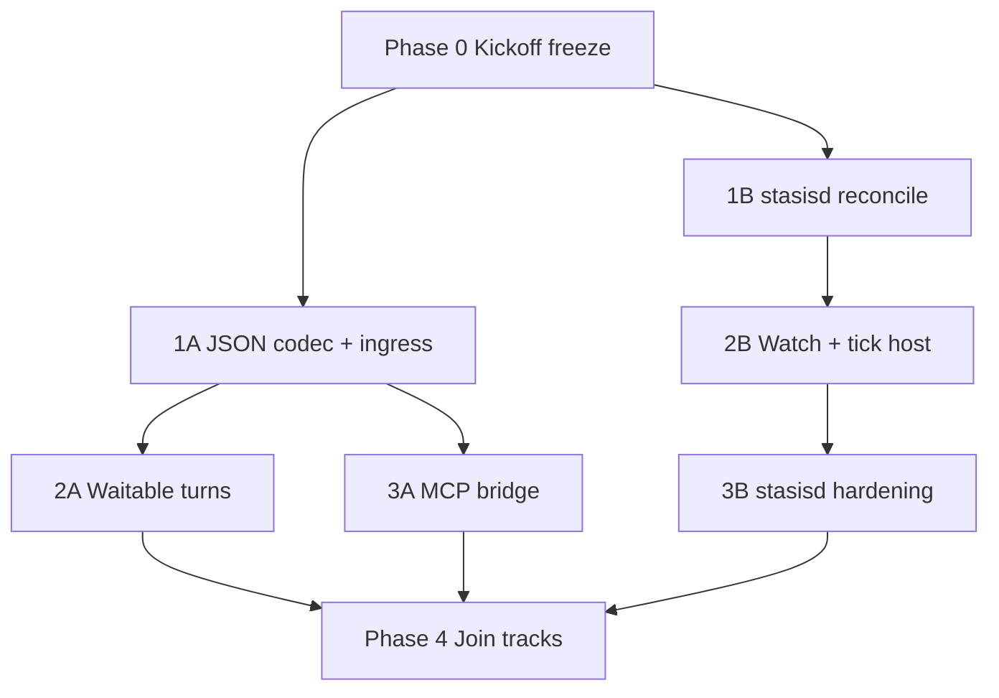

# Epic: Agent Platform Contracts + `stasisd`

## Document Metadata

- Document Type: Architecture Standard
- Audience: Engineer, Architect, Platform Owner
- Stability: Evolving
- Last Verified: 2026-07-22
- Verified Against:
  - docs/adr/ADR-0007-agent-platform-runtime-contracts.md
  - docs/adr/ADR-0008-stasisd-declarative-engine.md
  - docs/design/agent-platform-runtime-contracts-plan.md
  - docs/design/stasisd-declarative-engine-plan.md
  - docs-book/src/agent-platform-contracts.md
  - docs-book/src/stasisd.md

Status: **Active Epic — Phase 2 Complete (M0 + M1 + M2)**  
Date: 2026-07-22  
Owner: Stasis Core

## 1. Epic goal

Ship Stasis as the durable work kernel for agent platforms, plus `stasisd` as the nginx-style declarative deployable:

```text
YAML/TOML  →  stasisd  →  Stasis runtime  →  jobs / tools / outbox
                              ↑
                    ADR-0007 contracts (comms · translation · MCP)
                              ↑
                    external gateways (outside repo)
```

**Done looks like:**

1. Platform builders can inject codecs/MCP gateways via ports (no vendor code in core).
2. Operators can run local agent schedules from YAML/TOML with add/edit/remove reconcile.
3. Fake external participant path works through contracts (not a vendor adapter).

## 2. North-star principles

1. **Runtime kernel ≠ deployable UX** — `stasis` stays library/runtime; `stasisd` is the process host.
2. **Contracts over vendors** — Cursor/Codex/etc. never land in `src/` or `stasisd/`.
3. **Desired state ≠ execution truth** — files reconcile into durable stores; Surreal/in-memory remain source of runtime truth.
4. **Reuse durable work** — leases, retries, DLQ, recurring materialization, outbox; no second orchestrator.
5. **Three planes stay separate** — Comms ≠ Translation ≠ MCP tool bridge.

## 3. Workstreams

| Track | ADR | Outcome |
| --- | --- | --- |
| **A — Platform contracts** | ADR-0007 | Comms + translation + MCP ports in kernel |
| **B — Declarative engine** | ADR-0008 | `stasisd` watch/reconcile/tick binary |
| **C — Join** | both | External participants + declarative refs to gateways |

Tracks A and B start in parallel after a shared kickoff. Track C waits on both.

## 4. Phased epic board

### Epic Phase 0 — Kickoff freeze (shared)

**Goal:** Lock names so A/B don’t diverge.

| Item | Decision to freeze |
| --- | --- |
| Envelope kinds v1 | From ADR-0007 plan §5.2 |
| `stasisd/v1` schedule schema | From ADR-0008 plan §5 |
| Module homes | `src/ports/outbound/agent/*` + workspace crate `stasisd` |
| Managed ID strategy | Prefer `stasisd:<id>` prefix for managed recurring defs |
| ADRs | Mark 0007 + 0008 Accepted when Phase 0 merges |

**Exit:** types/ports/crate skeleton compile; docs say Ready for Implementation; conformance green.

**First cooking slice (recommended start):**

1. Accept ADR-0007 + ADR-0008 (status flip in docs).
2. Add agent envelope + port trait stubs in `stasis`.
3. Scaffold workspace `stasisd` with `--config` / `--once` / `--strict`.
4. Empty-dir `--once` succeeds.

---

### Epic Phase 1 — Two vertical slices (parallel)

#### 1A — Contracts: JSON codec + ingress skeleton

- Canonical `AgentEnvelope` encode/decode (JSON v1)
- `AgentEventIngress` idempotent accept (in-memory)
- Publish path wired enough for unit round-trip
- **Exit:** grant→complete envelope round-trip test (no external agent yet)

#### 1B — `stasisd`: load → validate → reconcile schedules

- YAML + TOML → `StasisdDocument`
- Create/update/`drain` against in-memory runtime
- Golden config fixtures
- **Exit:** add file → recurring def → materialize job; remove file → no new jobs

---

### Epic Phase 2 — Make them real processes

#### 2A — Waitable turn job (contracts)

- Parked wait record + correlation on ingress
- Timeout → retry/DLQ
- Mixed session: local tool-loop + fake external (in-process fake gateway)
- **Exit:** durable external turn completes via ingress

#### 2B — `stasisd` watch + tick host

- FS watch + debounce + periodic full reconcile
- Long-running materialize/process/publish loop
- Surreal backend via existing composition
- **Exit:** cookbook “drop TOML, job runs, remove TOML, schedule stops” without custom Rust main

---

### Epic Phase 3 — MCP bridge + hardening

#### 3A — MCP provider/exporter

- `McpToolProvider` merge into `ToolRegistry`
- `McpToolExporter` allowlist + recursion budget
- Builder DI methods + extension-points docs
- **Exit:** tool loop invokes provider tool; export invokes local `#[stasis_tool]`

#### 3B — Operator hardening

- `--strict` quarantine semantics
- provenance/`managed_by` filters
- graceful shutdown; optional `/healthz`
- systemd example + runbook
- **Exit:** invalid sibling file doesn’t break good schedules

---

### Epic Phase 4 — Join the tracks

- `stasisd` config fields for `participant.kind = external` + endpoint refs
- Declarative comms endpoint resources (vendor-neutral)
- Optional MCP gateway socket/command refs in config
- End-to-end: TOML schedule → local + fake external via contracts
- **Exit:** platform-builder cookbook with zero vendor names

## 5. Dependency graph



**Critical path to “nginx demo”:** `0 → 1B → 2B`  
**Critical path to “interop demo”:** `0 → 1A → 2A → 3A → 4`

## 6. Milestone checklist

Use this as the epic burndown. Check when exit criteria land.

### M0 — Kickoff
- [x] ADR-0007 Accepted
- [x] ADR-0008 Accepted
- [x] Agent port/module stubs compile
- [x] `stasisd` crate `--once` on empty config works
- [x] ID strategy + schema freezes documented (`stasisd:<id>` prefix)

### M1 — Vertical slices
- [x] JSON codec golden tests
- [x] Ingress idempotency tests
- [x] `stasisd` add/edit/drain reconcile tests
- [x] Materialize-from-reconcile integration test

### M2 — Runnable demos
- [x] Waitable external turn (fake gateway)
- [x] `stasisd` watch cookbook green on Surreal or in-memory
- [x] docs-book cookbooks linked from SUMMARY

### M3 — Bridge + harden
- [ ] MCP provider/exporter + recursion guard
- [ ] Builder DI documented in extension-points
- [ ] `--strict` + provenance ownership tests
- [ ] Runbook + systemd example

### M4 — Unified platform story
- [ ] Declarative external participant config
- [ ] E2E TOML → mixed local/external session
- [ ] Epic exit criteria satisfied (section 8)

## 7. Explicit non-goals (entire epic)

1. Vendor adapters (Cursor, Codex, Claude Code, Grok, Hermes, OpenClaw, …)
2. Replacing `AiChatClient` / `genai`
3. Full K8s operator / CRDs
4. Exactly-once cross-process messaging beyond current outbox semantics
5. Hot-loading arbitrary Rust tools from config

## 8. Epic exit criteria

1. External team can implement a gateway from public ports/docs only.
2. Operator can run a recurring agent session from YAML/TOML only.
3. Mixed local + fake external session works durably with retry/DLQ.
4. MCP provider tools work in tool loops; exported Stasis tools invoke correctly.
5. No vendor-oriented modules under `src/` or `stasisd/`.
6. ADR-0007 + ADR-0008 Accepted with verification against implemented ports/binary.

## 9. Suggested execution cadence

Work in thin vertical PRs, not phase-sized monoliths:

| Slice order | PR theme |
| --- | --- |
| 1 | Phase 0 freeze + stubs + `stasisd` skeleton |
| 2 | `stasisd` YAML/TOML parse + validate |
| 3 | `stasisd` reconcile drain path |
| 4 | Agent envelope + JSON codec |
| 5 | Ingress store + round-trip |
| 6 | `stasisd` watch + tick loop |
| 7 | Waitable turn handler |
| 8 | MCP provider merge |
| 9 | MCP exporter + recursion guard |
| 10 | Join: declarative external participant |

Parallelize 2–3 with 4–5 after slice 1 merges.

## 10. Source plans (detail)

- Contracts detail: [agent-platform-runtime-contracts-plan.md](agent-platform-runtime-contracts-plan.md)
- `stasisd` detail: [stasisd-declarative-engine-plan.md](stasisd-declarative-engine-plan.md)
- ADRs: [ADR-0007](../adr/ADR-0007-agent-platform-runtime-contracts.md), [ADR-0008](../adr/ADR-0008-stasisd-declarative-engine.md)

This epic is the sequencing authority when those docs disagree on order; those docs remain the contract/spec authority for shapes and acceptance detail.

## 11. Start here

**Next action:** execute Epic Phase 0 first cooking slice (section 4) on a feature branch — accept ADRs, scaffold ports + `stasisd`, land empty `--once`.
