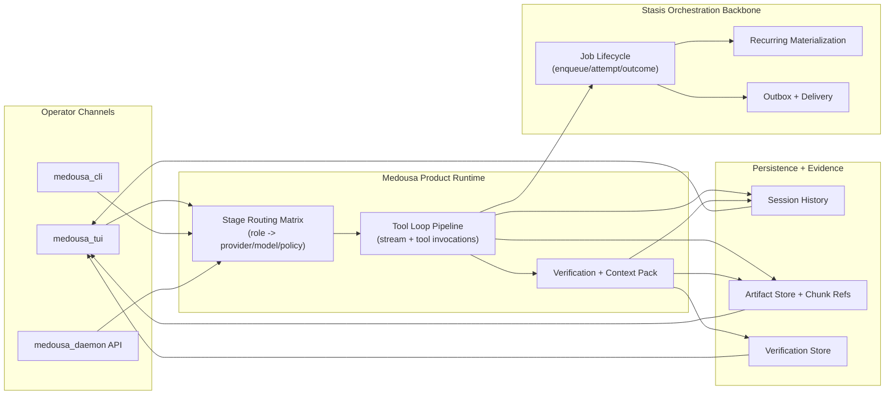
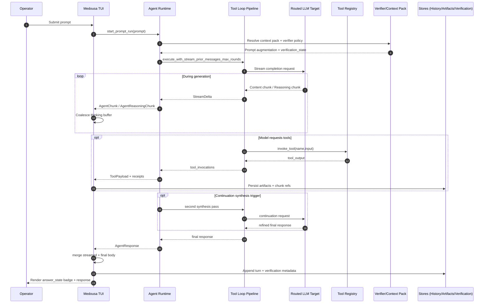
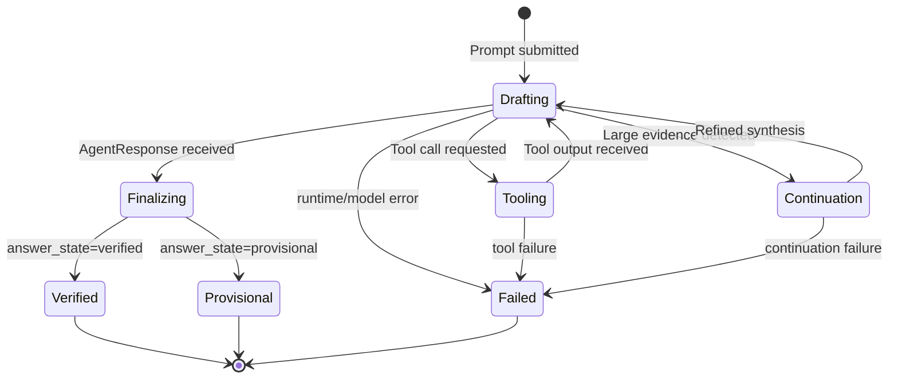

# Medousa Architecture And Flow Guide

## Executive Summary

Medousa is a policy-guided cognitive runtime product built for high-accountability operations.

It combines:

- deterministic orchestration behavior from Stasis
- tool-first evidence acquisition
- verification and confidence signaling
- operator-controlled routing and runtime policy

The result is a platform that remains useful even when tool execution degrades, because policy adherence and reasoning behavior still remain structured and observable.

## 1) System Topology

## 2) Prompt-To-Answer Runtime Flow

## 3) Answer Trust State Lifecycle

## 4) Operator Control Plane

Primary control points:

- global provider/model/base-url
- per-stage route target and policy profile
- verifier thresholds
- response depth mode
- tool-call strictness and round limits

Design implications:

- operators can tune speed vs quality by stage
- trust posture can be tightened without rewriting workflows
- fallback behavior remains explicit and reviewable

## 5) Evidence And Governance Model

Governance posture in Medousa centers on inspectability:

- tool invocation payloads are receipted
- large payloads are artifacted and chunk-referenced
- verification reports are persisted and queryable
- answer state is represented as metadata (`verified` or `provisional`)

This gives teams a practical audit trail from user question to produced answer.

## 6) Resilience And Degraded-Mode Behavior

Medousa supports graceful degradation:

- context and prompt budgets cap request size
- continuation synthesis can recompose large evidence sets
- typed reasoning stream handling preserves model thought flow when available
- fallback paths keep the assistant useful when tools fail

In degraded conditions, the expected behavior is a clear uncertainty statement plus actionable recovery guidance, not a silent failure.

## 7) Small-Model Guidance (3B-4B Class)

For constrained models, reliability improves when prompts remain explicit and bounded.

Recommended settings:

- strict or analytical policy on verifier stage
- moderate max tool rounds (avoid deep recursion)
- concise response depth for low-latency first pass
- stage-specific routing where synthesis uses a stronger model if available

Prompting guidance:

- keep task objective and output format concrete
- separate facts from hypotheses explicitly
- ask for structured takeaways with uncertainty notes
- force tool-grounding language for real-world claims

## 8) Enterprise Rollout Checklist

1. Define stage routing baseline for each environment.
2. Set verifier thresholds aligned to risk tolerance.
3. Validate artifact and verification retention policies.
4. Exercise failure scenarios: missing keys, tool parse errors, partial outages.
5. Establish operator runbooks for routing sync and degraded-mode response.
6. Track quality metrics: verified ratio, tool failure rate, continuation hit rate.

## 9) Key Implementation Anchors

- `medousa/src/bin/medousa_tui/agent_runtime.rs`
- `medousa/src/bin/medousa_tui/event_reducer.rs`
- `medousa/src/bin/medousa_tui/settings_ui.rs`
- `medousa/src/tools.rs`
- `medousa/src/stage_routing.rs`
- `medousa/src/verification_store.rs`
- `medousa/src/context_pack.rs`